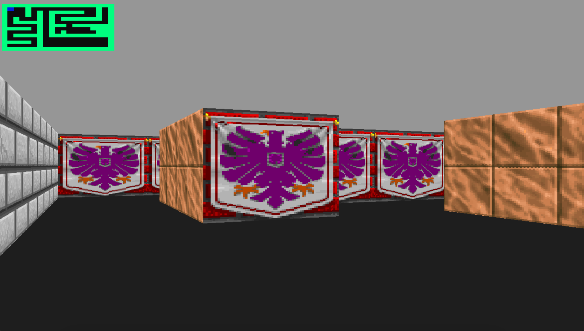

# 42-cub3d
This project is inspired by the world-famous eponymous 90's game, which was the first FPS ever. It will enable you to explore ray-casting. Your goal will be to make a dynamic view inside a maze, in which you'll have to find your way.

## How to use
	>. make
	>. ./cub3D maps/map_maze.cub
	***
	Use `WASD` and a mouse to play
	Use `M` to show or remove the minimap
	Use `ESC` to exit
## Subject
**The assignment is here!** [(link)](https://github.com/AtaullinShamil/42-cub3d/blob/main/includes/cub3d_subject.pdf)
