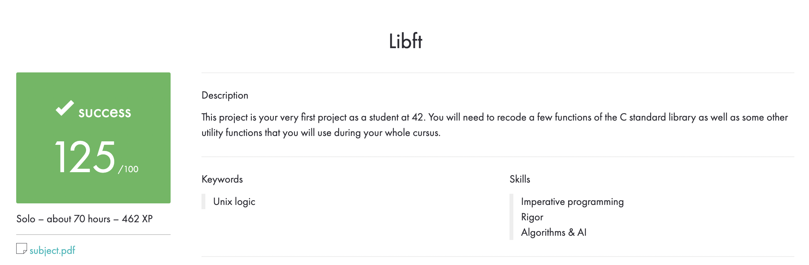

# 42-Libft
### This project is about coding a C library. It contains a lot of general purpose functions

# Makefile
|Command|Action|
|-------|------|
|`make`|Compiles **.c** files and creates the **libft.a** library|
|`make bonus`|Compiles bonus part **.c** files and creates the **libft.a** library|
|`make clean`|Deletes **.o** files|
|`make fclean`|Deletes **.o** files and the **libft.a** library|
|`make re`|Rebuilds the library|
# Subject
**The assignment is here!** [(link)](https://github.com/AtaullinShamil/42-Libft/blob/main/includes/Libft_subject.pdf)
